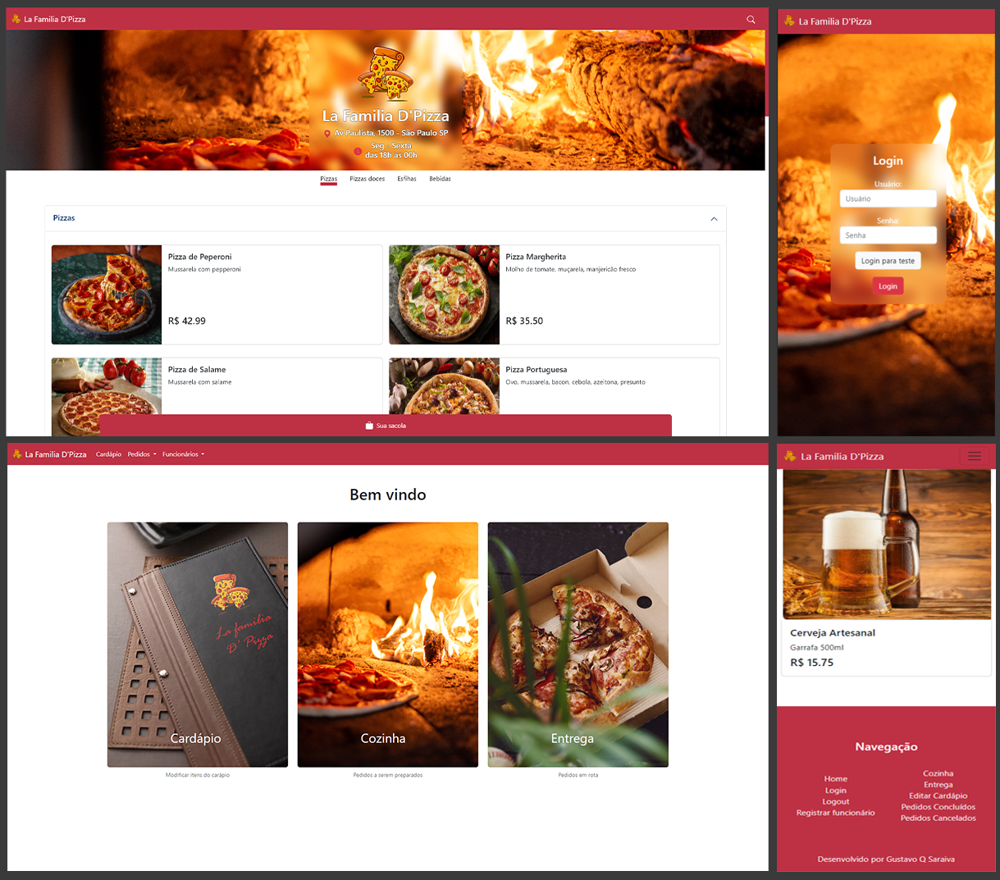

## La Família D'Pizza


Veja mais imagens e um [vídeo](https://www.youtube.com/watch?v=cFS2MGdqH0w) do projeto em ação: [aqui](./screenshots/README.md)

## Descrição

Website completo de uma pizzaria, desenvolvido com Flask, MySQL, Javascript e Bootstrap.

Por meio deste projeto, aprendi sobre integração e manipulação de banco de dados, e desenvolvimento de APIs.

Este projeto faz parte do meu portifólio, portanto, ficarei feliz de receber qualquer [feedback](#contato) que possa ajudar a me tornar um desenvolvedor melhor!

## Funcionalidades

- Clientes
  - Visualizar cardápio.
    
  - Pesquisa dinâmina de itens do cardápio
    - A cada entrada de texto, é feita uma solicitação AJAX que atualiza a interface em tempo real com resultados correspondentes
    
  - Adicionar itens ao carrinho.
    - Campo de observações para cada item (ex: sem cebola, ...)

  - Modificar quantidade de itens no carrinho.
    
  - Confirmar pedido.
    - Preenchimento automático dos campos "Rua", "Bairro" e "Cidade" conforme o CEP informado, através da [API ViaCep](https://viacep.com.br/)
    
  - Verificar status do pedido (preparado, a caminho ou entregue)
    
- Funcionários
  - Login de funcionário para acesso administrativo.
    
  - Registro de novo funcionário.
    
  - Gerenciar pedidos (preparo, entrega, cancelamento, concluído).
    
  - Editar o cardápio.
    - Adicionar novo item
    - Habilitar/desabilitar itens do cardápio
    - Modificar itens (preço, imagem, nome e categoria: pizza, pizza doce, esfiha ou bebida)

## Observações

1. Dentro da pasta [database_init](./database_init), existem arquivos .sql que executam querys para: criar o banco de dados (tabelas e etc.), inserir itens no cardápio e alguns pedidos (dados gerais e seus respectivos itens) 

2. Por enquanto, não existe nenhum sistema de pagamento. O sistema apenas informa se o cliente deseja pagar em dinheiro ou cartão.

3. Para os ícones (logotipo e ícone do status do pedido), modifiquei e juntei alguns ícones criados pelo autor [catalyststuff](https://br.freepik.com/autor/catalyststuff) pela plataforma [Freepick](https://br.freepik.com/)

## Tecnologias Utilizadas

### 1. Frameworks
   - [Flask](https://flask.palletsprojects.com/en/3.0.x/)
   - [Bootstrap v5.3](https://getbootstrap.com/docs/5.3/getting-started/introduction/)

### 2. Bibliotecas
   
   Conforme o arquivo [requiriments.txt](./requirements.txt) gerado pelo pip, segue uma lista das bibliotecas utilizadas:
   - blinker v1.7.0
   - click v8.1.7
   - colorama v0.4.6
   - Flask v3.0.0
   - itsdangerous v2.1.2
   - Jinja2 v3.1.2
   - MarkupSafe v2.1.3
   - mysql-connector-python v8.2.0
   - protobuf v4.21.12
   - Werkzeug v3.0.1

### 3. Banco de dados
   
   - [MySQL](https://www.mysql.com/)
     - Por meio da biblioteca [mysql-connector-python](https://pypi.org/project/mysql-connector-python/)

## Como executar

### 1. Pré-requisitos

Para executar este projeto, é necessário ter o [Python 3.11](https://www.python.org/downloads/) e o [MySQL](https://www.mysql.com/) instalados na máquina.

### 2. Instalação

Clone o repositório
```
$ git clone https://github.com/GustavoQS/webiste-pizzaria.git
```

### 3. Ative o ambiente virtual

- No windows:
  ```
  $ venv\Scripts\activate
  ```
- No macOS/Linux:
  ```
  $ source venv/bin/activate
  ```

### 4. Instale as dependências

```
$ pip install -r requirements.txt
```

### 5. Crie o banco de dados MySQL

- Abra a pasta [database_init](./database_init) e execute o arquivo [init.sql](./database_init/init.sql) para criar o banco de dados.

- Opicional:
  - Execute os demais arquivos .sql para inserir alguns dados pré definidos, como itens do cardápio, alguns pedidos e seus respectiovos itens.


### 6. Execute o projeto

```
$ python run.py
```

### 6. Acesse o projeto

- Acesse [localhost](http://localhost:5000) no navegador de sua preferência


## Contato

Meu e-mail: [gustavoqsaraiva@gmail.com](mailto:gustavoqsaraiva@gmail.com)

Conecte-se comigo no meu [Linkedin](https://www.linkedin.com/in/gustavo-quirino-saraiva/)


   
  
 


