## La Família D'Pizza - Visualização

Assista ao [vídeo](https://www.youtube.com/watch?v=cFS2MGdqH0w) do projeto em execução no meu canal do Youtube.

## Navegação

- [Cliente](#cliente)
  - [Home](#home)
  - [Seleção de Item](#seleção-de-item)
  - [Pesquisa](#pesquisa)
  - [Sacola](#sacola)
  - [Confirmar pedido](#confirmar-pedido)
  - [Status do pedido](#status-do-pedido)
    
- [Funcionário](#funcionário)
  - [Login](#login)
  - [Home dos funcionários](#home-dos-funcionários)
  - [Ver cardápio](#ver-cardápio)
  - [Adicionar item](#adicionar-item)
  - [Editar item](#editar-item)
  - [Cozinha](#cozinha)
  - [Entrega](#entrega)
  - [Pedidos concluídos](#pedidos-concluídos)
  - [Pedidos cancelados](#pedidos-cancelados)
  - [Registro de funcionário](#registro-de-funcionário)

- [Mensagem de erro](#mensagem-de-erro)

## Cliente

Veja as funcionalidades que os clientes do website tem acesso

### Home
  - Página inicial do usuário, para visualizar o cardápio
    
    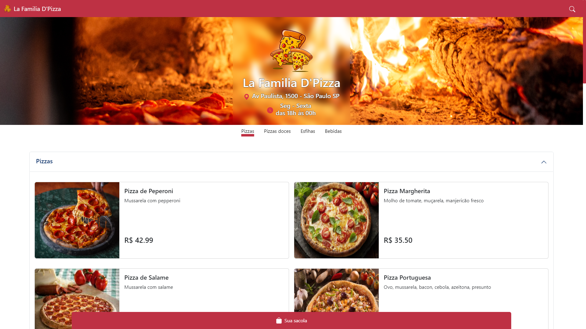

### Seleção de Item
  - Este canvas aparece quando o usuário clica em algum item do cardápio

    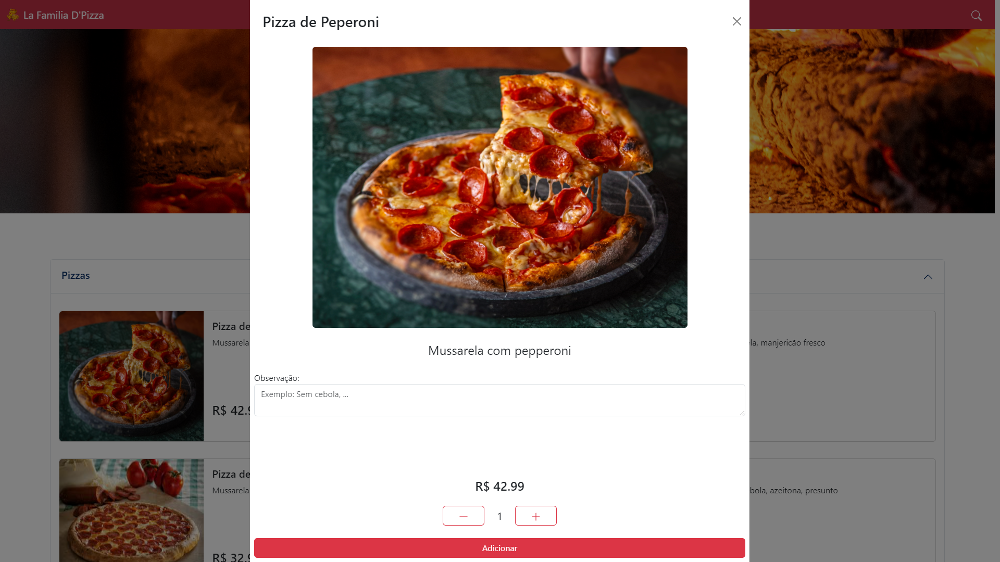

### Pesquisa
  - Quando o usuário clica no ícone da lupa, este canvas aparece. Possibilita o usuário fazer uma pesquisa dinâmica.

    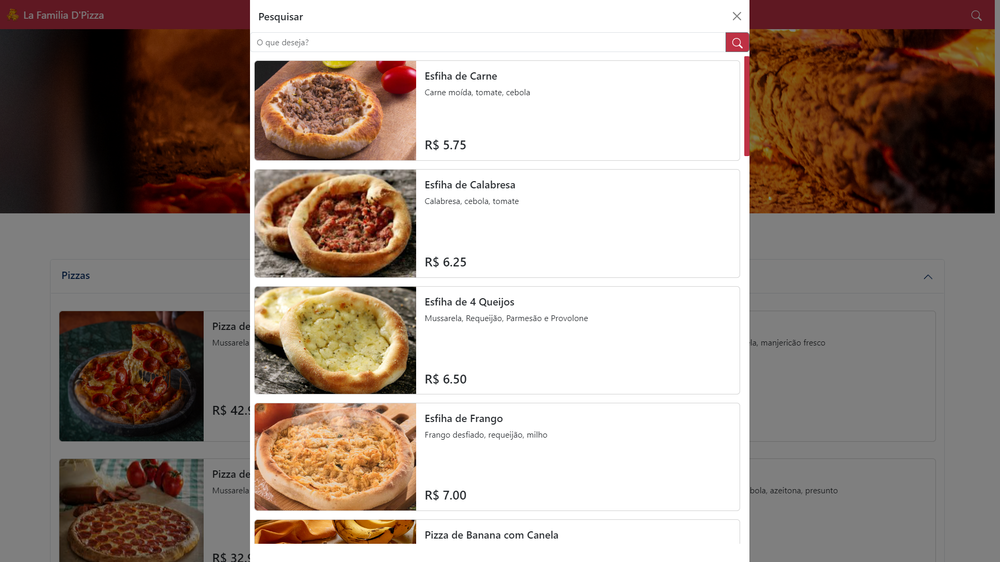

### Sacola
  - Canvas que mostra a sacola do usuário, com os itens adicionados.
  - Também permite alterações na sacola, basta clicar no item que um canvas de [Seleção de Item](#seleção-de-tem) aparece, mas adaptado as funcionalidades da sacola.

    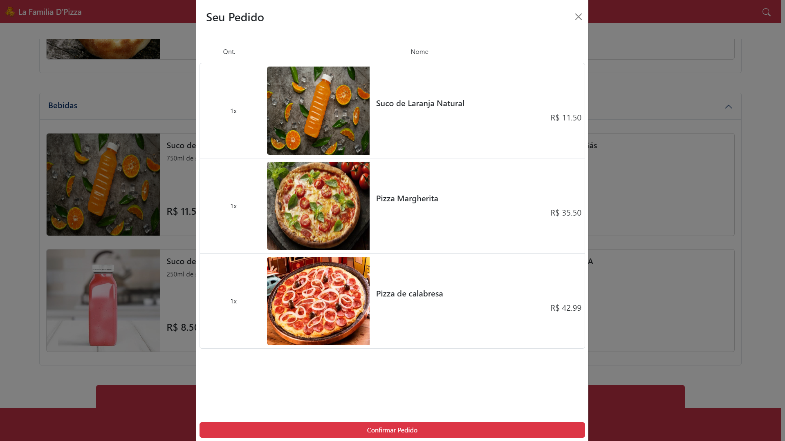

### Confirmar Pedido
  - Este canvas fica visível quando o usuário seleciona a opção "Confirmar Pedido" na sacola.
  - Aqui que a [API ViaCep](https://viacep.com.br/) é utilizada.

    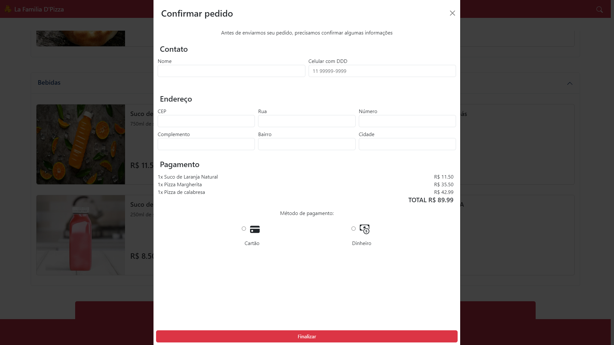

### Status do pedido
  - Após confirmar o pedido, o usuário pode verificar o status do mesmo, através do ID de pedido
  - Esta página é automaticamente aberta ao confirmar o pedido

    1. Sendo preparado
       
       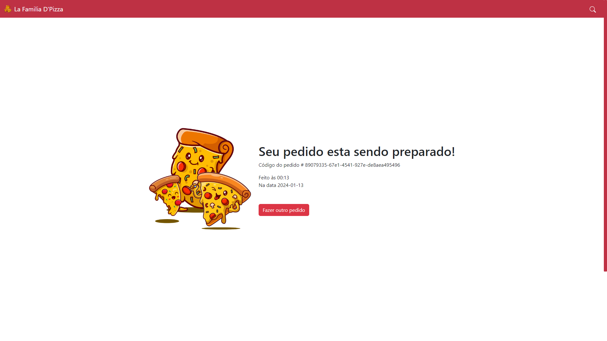

    2. A caminho

       

    3. Entregue

       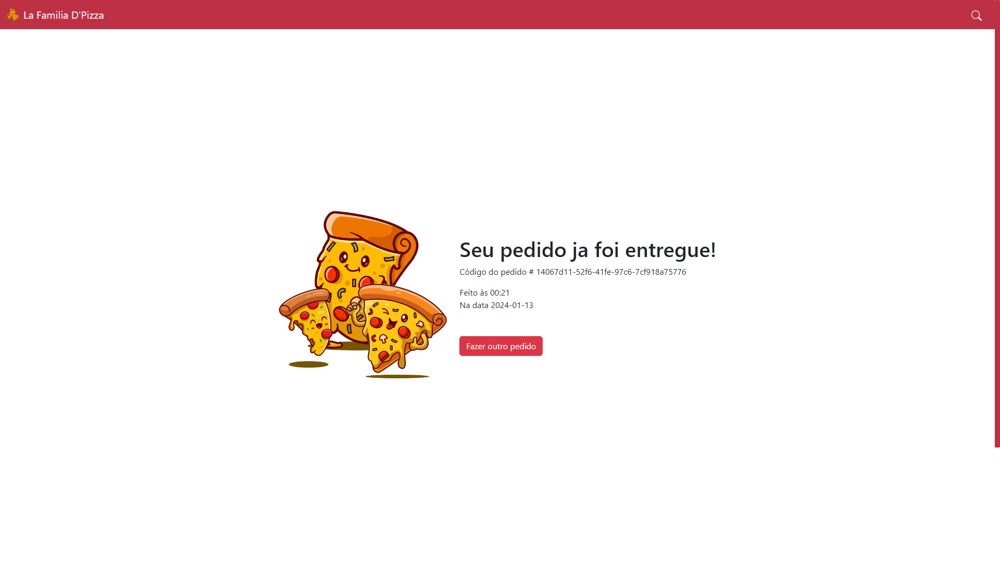

## Funcionário

Funcionalidades que apenas os funcionários tem acesso, após passarem por um sistema de login

### Login
  - Sistema que permite o login de funcionários
    
    

### Home dos funcionários
  - Página inicial dos usuários, que os permitem selecionar onde desejam ser redirecionados.
    
    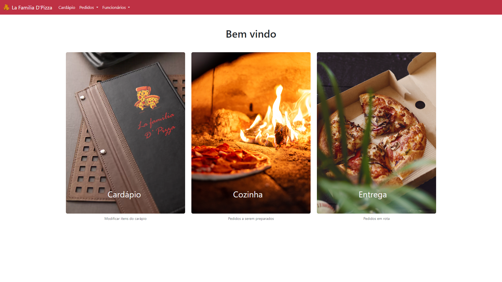

### Ver cardápio
  - Página que permite visualizar o cardápio, abrindo possibilidade do uso de mais funções
    
    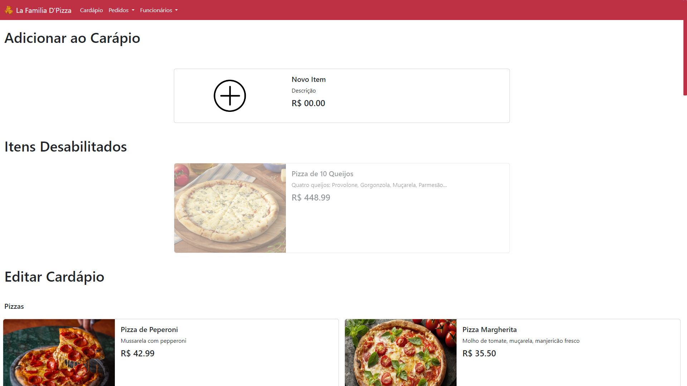

### Adicionar item
  - Canvas que permite a adição de um novo item
    
    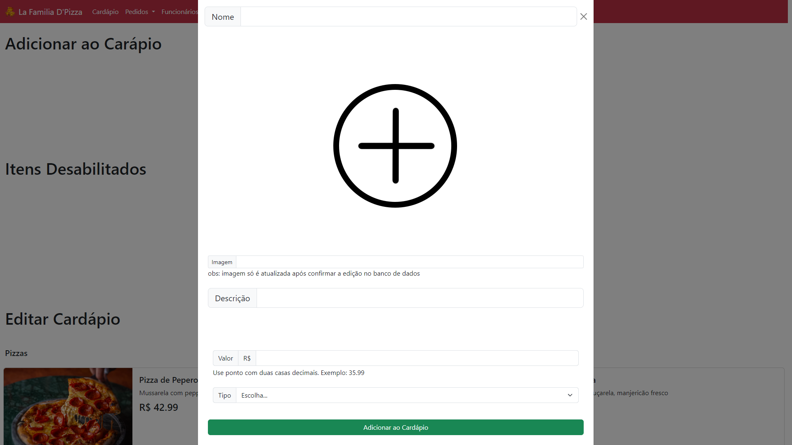

### Editar item
  - Modificação de item ja existente
    
    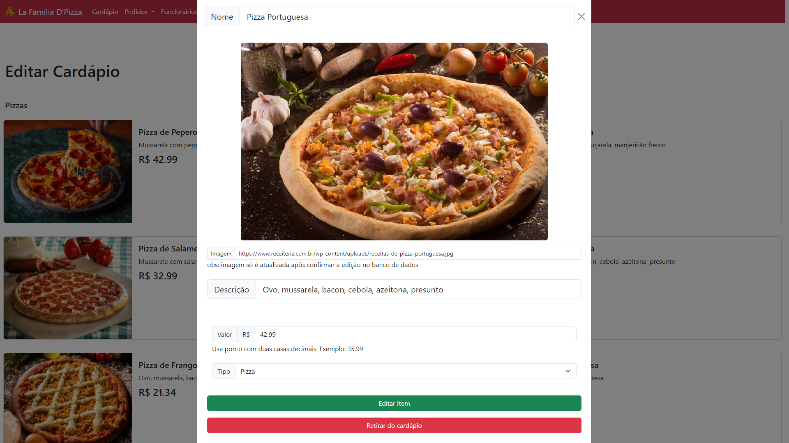

### Cozinha
  - Visualização de pedidos a serem preparados
    
    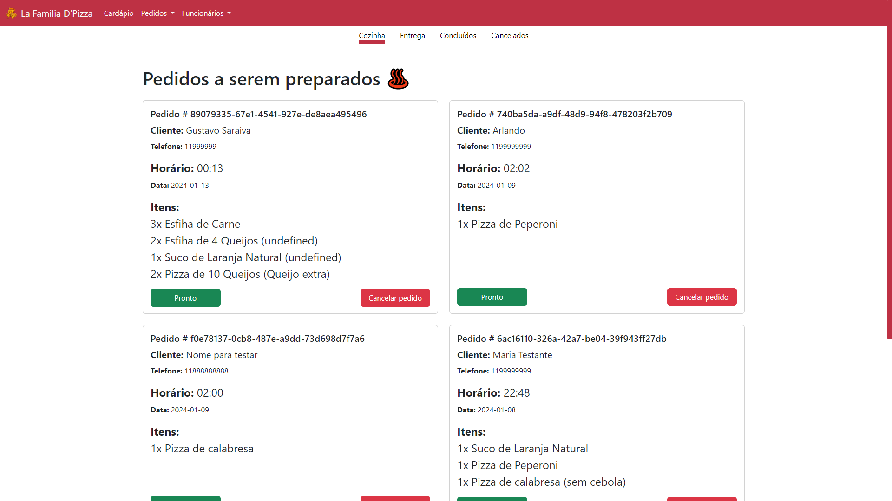

### Entrega
  - Permite visualizar pedidos que estão a caminho do endereço do cliente
    
    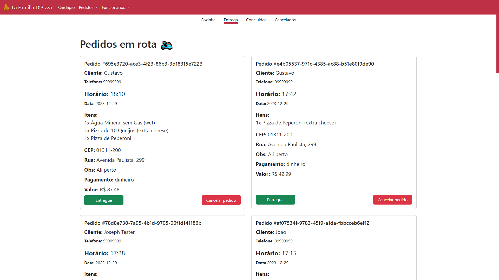

### Pedidos concluídos
  - Veja os pedidos que foram entregues e concluídos
    
    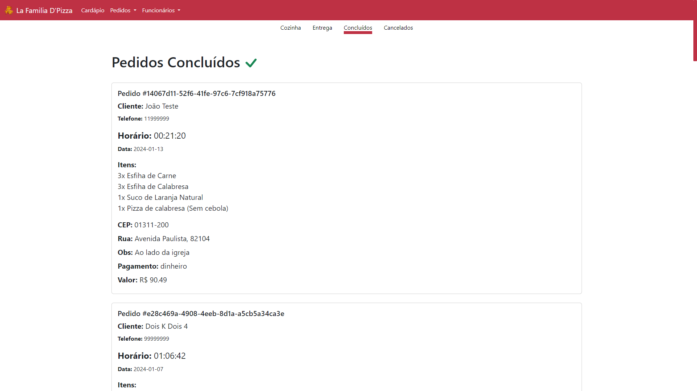

### Pedidos cancelados
  - Pedidos que por algum motivo, foram cancelados no processo de preparo ou entrega.
    
    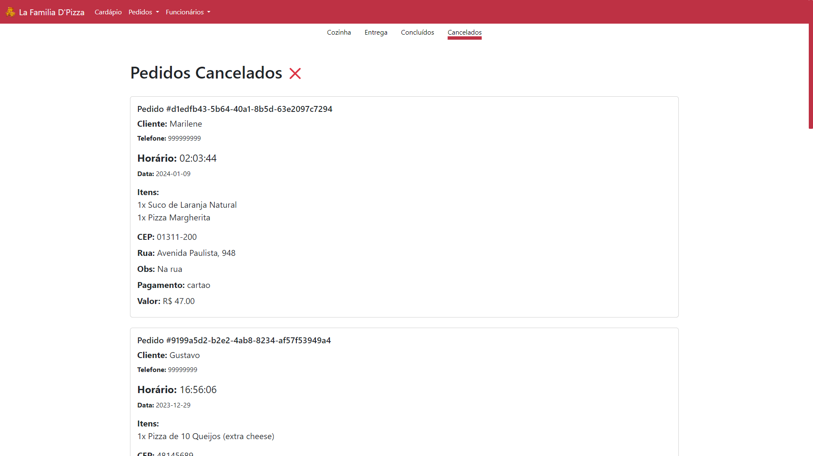

### Registro de funcionário
  - Formulário para registro de um novo funcionário
    
    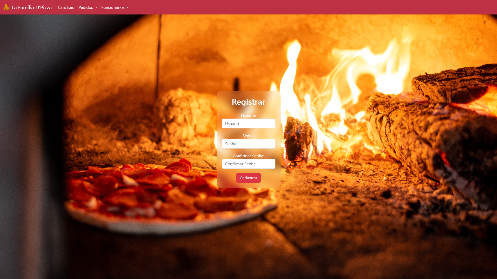

## Mensagem de erro

Mensagem que aparece quando algum erro inesperado acontece.

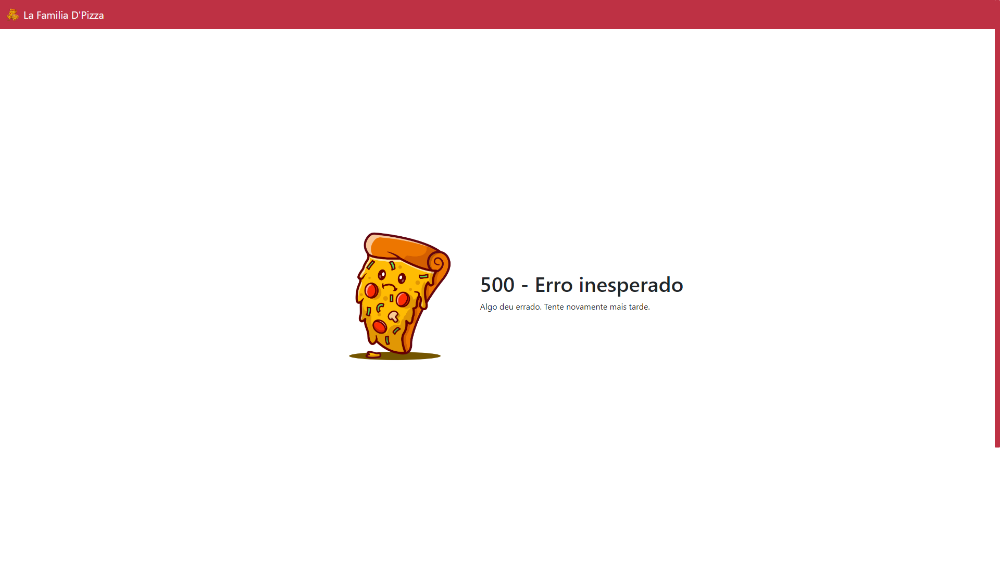
